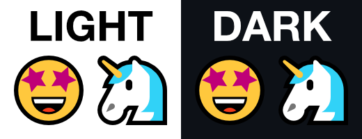

# Microsoft Segoe UI Emoji SVGs Icons

3070 Vector based [Emoji-12.0](https://emojipedia.org/emoji-12.0/) icons out of the Windows 10 style from the 
[Microsoft Windows 10 May 2019 Update](https://emojipedia.org/microsoft/windows-10-may-2019-update/). 
The icons are available in SVG and high quality PNG. 

The Windows 10 version has its own simple, succinct and even hilarious style. 
It works great on light or dark themes. Unfortunately even on Windows it’s not possible to use it with every software. 
Using them directly in vector graphics is very cumbersome and worst case: every platform displays it differently. 
This repo should help to get a better access to this great font.

## 👉 Disclaimer
The icons are based on the colored font 
[Microsft Segoe UI Emoji](https://docs.microsoft.com/de-de/typography/font-list/segoe-ui-emoji) 
which is already available on many places like: 
[Github - zippw](https://github.com/zippw/me/blob/main/fonts/seguiemj.ttf),
[Github.com - Linrstudio](https://github.com/Linrstudio/linrstudio.github.io/blob/c28ff86463429dfa0123a98589da37c11121733b/win11/SEGUIEMJ.TTF), 
[Fonts100](https://www.fonts100.com/font+89947_Segoe+UI+Emoji.html), 
[Legionfonts](http://legionfonts.com/fonts/segoe-ui-emoji), 
[Maisfontes.com](https://de.maisfontes.com/segoe-ui-emoji.schriftart). 
In addition, it’s also included in every Windows 10 installation.
Also, the png files of all emojis are already public on [Emojipedia](https://emojipedia.org/microsoft/windows-10-may-2019-update/).
The icons in this repository are just converted symbols of this public font.
However, the font is not OpenSource, so please respect its licence.

## 📜 Licence
The font is copyrighted by Microsoft Corporation. All Rights Reserved. 
Before using it, check out the 
[Microsoft Typography & Licensing](https://www.fonts.com/content/microsoft-typography) guide.